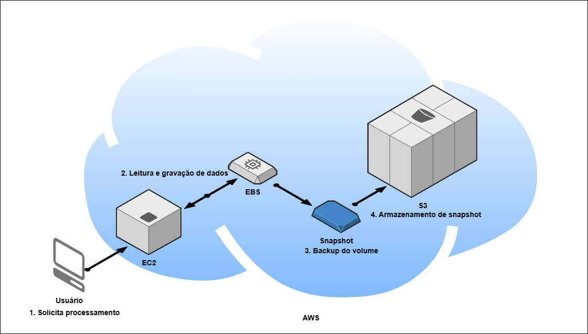

# Bootcamp-Code-Girls-Desafio-1

# Etapas do Fluxo EC2 ↔ EBS
- Etapa 1: Criação do Volume EBS:
  
  O volume é criado na mesma Availability Zone da instância EC2;
  Pode ser do tipo gp3, io1, st1, etc., dependendo da performance desejada
- Etapa 2: Anexar Volume à EC2:
  
  O volume é anexado à instância EC2;
  EC2 reconhece o volume como um disco adicional
- Etapa 3: Montagem e Formatação:
  O volume é formatado e montado no sistema operacional da EC2;
  Pode ser usado para armazenar logs, bancos de dados, arquivos de aplicação
- Etapa 4: Operações de Leitura/Escrita:
  EC2 realiza operações de leitura e escrita no volume EBS;
  Os dados são persistentes mesmo se a EC2 for desligada
- Etapa 5: Snapshot (Backup):
  Você pode criar snapshots do volume EBS;
  Snapshots são armazenados no Amazon S3 (internamente)
- Etapa 6: Monitoramento:
  O uso do volume pode ser monitorado via Amazon CloudWatch
  Métricas como IOPS, throughput e uso de disco
